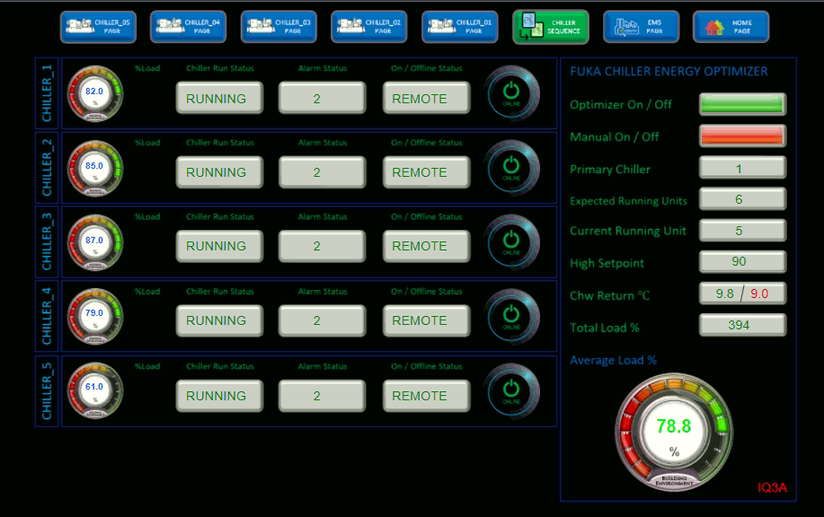

# Fuka Chiller Energy Optimizer©

There are 3 operation modes;
1. Optimizer - Auto 'Remote' operation.
   Control is decided by the proprietery optimization algorithm. Manually switching ON and OFF chillers are allowed but may be overriden by system. Optimization by algorithm will take priority.  
2. Manual - 'Remote' operation.
   Control is completely decided by the 'Control UI' via telemetry communication. It will override the chiller status and synchronize 'panel status' to the actual chiller units.
3. OFF - Complete 'Local' operation.
   Control is determined by the chiller unit itself. 'Control UI' will synchronize the actual server state with the visualization.

## Optimizer
The algorithm optimizes the operation of chillers based on few criterias;
1. When `Avg load %` < `Load % SP`, Then next CH in `Running` state is set to `OFF`. 
2. When `T load %` > `CH Load % (n-1)` AND remainder `(T Load %)` > `Load % SP`, Then next CH in `Standby` state is set to `ON`. 
3. When `CHWR °C` > `CHWR °C SP`, Then system will be in 'Recovery State' AND next CH in `Standby` state is set to `ON`. 
4. Given in 'Recovery State', When `CHWR °C` < `CHWR °C SP` AND after `10` optimization cycles, Then system will resume normal 'Optimization State'.

## Configurable parameters
| Name               | Use                                           | Default |
| ------------------ | --------------------------------------------- | ------- |
| CHILLER ON/OFF     | Get/ Set state of Chiller                     | OFF     |
| UPPER_LIMIT        | Set high value for optimization               | 90      |
| CWR_TEMP_HIGHPOINT | Set the high temperature for 'Recovery State' | 9.0     |

## Information parameters
| Name            | Description                                                                                                                                            |
| --------------- | ------------------------------------------------------------------------------------------------------------------------------------------------------ |
| PRIMARY_CHILLER | Usually indicates the last running chiller unit which has been switched off. It serve as reference to the next longest running unit which is after it. |
| RUNNING_UNIT    | Indicate current running units AND not in Standby mode.                                                                                                |
| EXPECTED_UNIT   | Expected units computed through auto-optimize algorithm.                                                                                               |